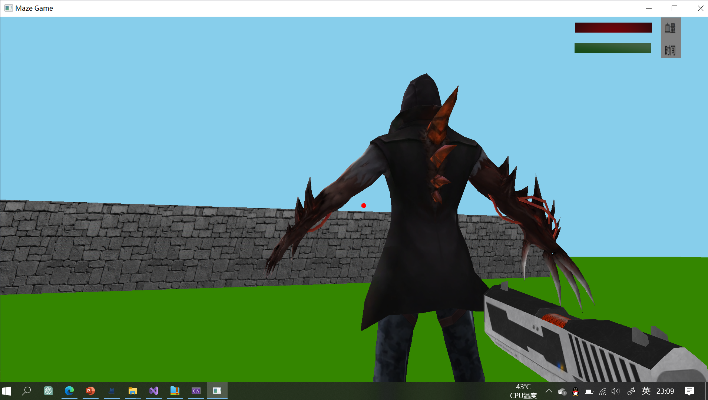
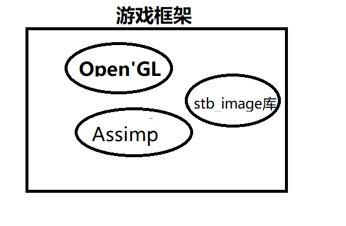
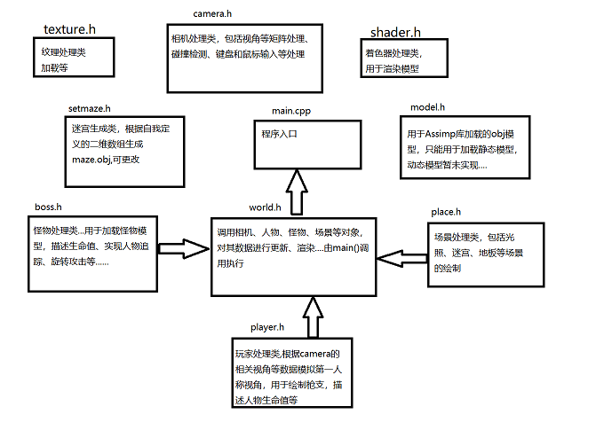

# Shoot Game

## 预览

通过根目录下exe文件可以直接打开

## 使用方法

代码环境：Windows10，Visual Studio2022

1. 下载代码，打开sln文件
2. 将library中的include文件夹添加至附加包含目录
3. 将library中的lib文件夹添加至附加库目录
4. 运行代码

程序简介：

迷宫数组1处表示迷宫入口，处于该位置游戏自动开始（怪物绘制渲染...追踪玩家等等...）；2表示出口，位于该位置游戏通过，游戏结束；9表示障碍物，不可穿行.....

